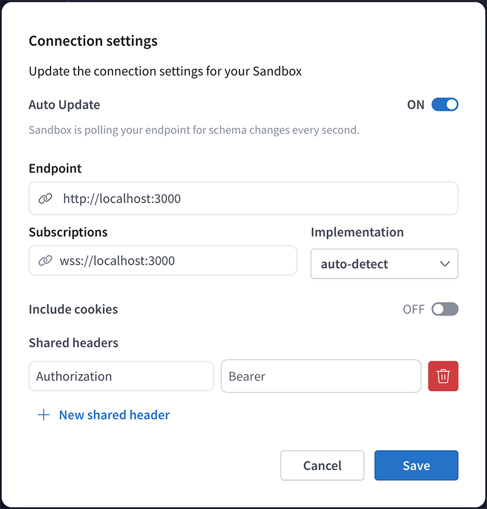
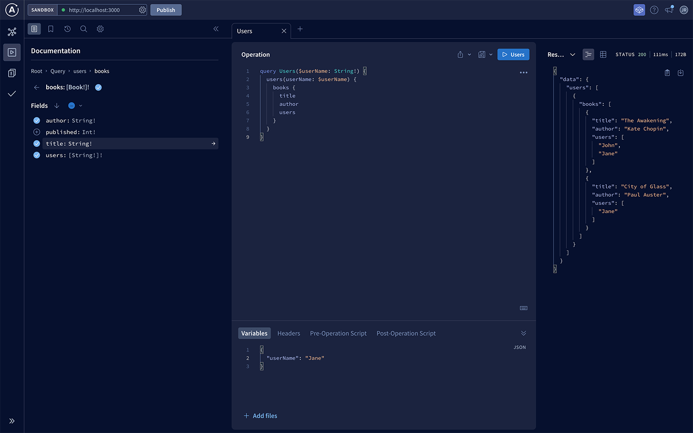

# GraphQL API Sample
version: 1.1.0

A GraphQL API sample with Apollo Server.

### Features
`Queries` : users/books or user(username)/book(username)   
`Mutations` : add/update/delete user or book

## Launch server
To launch the server, you have to execute in terminal this following command :

```bash
pnpm start
```

## Environment variable
You need to add a token in `.env` file like :

```bash
APOLLO_TOKEN=
```

## Apollo Studio Explorer
Then go to the [Apollo Studio Explorer](https://studio.apollographql.com/sandbox/explorer) and configure the connection.


````
EndPoint: http://localhost:3000
Suscriptions: wss://localhost:3000
````



And configure the headers:
````
Authorization: Bearer yourApolloToken
````

Now, you can trying to explore API !



👨🏽‍💻